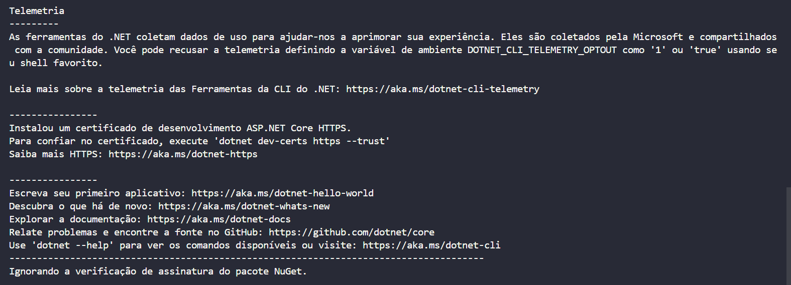

# Ponderada M9S4 - Sonar Qube

O SonarQube é uma plataforma de análise estática de código-fonte, projetada para aprimorar a qualidade e segurança do software. Essa ferramenta de análise estática identifica automaticamente vulnerabilidades, bugs, padrões de código duplicados e outros problemas potenciais no código-fonte de um projeto. Ao avaliar a conformidade com as melhores práticas de codificação e padrões de segurança, o SonarQube fornece uma visão abrangente da qualidade do código, facilitando a identificação e correção de problemas em estágios iniciais do desenvolvimento.
 
 Sua importância reside na capacidade de promover a manutenção de código mais eficiente, melhorar a segurança e a estabilidade do software, reduzindo assim os riscos associados a falhas e vulnerabilidades. Utilizar o SonarQube em projetos contribui significativamente para a entrega de software de alta qualidade, alinhado com as melhores práticas de desenvolvimento.

 # Aprendizado 

 * Visão Abrangente da Qualidade do Código: Configurar o SonarQube proporciona uma visão abrangente da qualidade do código, permitindo uma compreensão mais profunda dos pontos fortes e áreas de melhoria no projeto.

* Identificação de Vulnerabilidades e Bugs: A ferramenta destaca automaticamente vulnerabilidades de segurança, bugs e outras questões críticas no código-fonte, ajudando os desenvolvedores a corrigir problemas antes que eles se tornem mais complexos.

* Padrões de Codificação e Conformidade: A configuração do SonarQube permite a verificação da conformidade com os padrões de codificação e melhores práticas definidos, promovendo a consistência e a legibilidade do código.

* Estabelecimento de Métricas de Desenvolvimento: A plataforma fornece métricas e estatísticas detalhadas sobre o código, auxiliando na avaliação do progresso, na identificação de áreas de alto risco e no monitoramento contínuo da evolução do código.

# Imagens

Inicializando o SonarQube

Instalando o SonarSacnner

Resultados Obtidos

